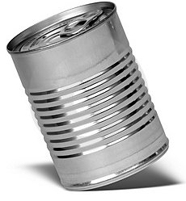

# Wat is metadata?

Meta van het griekse μετά wordt gebruikt om aan te geven dat het een abstractie is van iets, gebruikt om deze aan te vullen. Het zegt iets over zichzelf. Metadata is 'data over data'. Ze beschrijft de inhoud van de data.

# Waarom metadata?

Zie onderstaand conservenblikje zonder etiquette. Als je deze blikjes in de winkel ziet staan, zul je pas na thuiskomst en na opening van het blikje zien wat erin zit. Op basis van kleur, geur en smaak kun je vaststellen wat er in het blikje zit. Of het (nog) verantwoord is om te eten, zal op basis van de geur en uiterlijk vastgesteld moeten worden. Of er ingrediënten in zitten die je niet lekker vindt of waar je allergisch voor bent kun je alleen proefondervindelijk ontdekken. Je zult echter nooit te weten komen wie dit product heeft gemaakt en of je het veilig kunt eten. De meesten van ons zullen zo’n blikje dan ook niet kopen. 

Zo ook met data. Als je niet weet wat het voorstelt, welke actualiteit het heeft, wie de data gemaakt heeft en met welke kwaliteit het is vastgelegd, zal alleen de maker van deze data deze vragen kunnen beantwoorden.
Met metadata wordt de geografische dataset zo beschreven dat zoekopdrachten gericht kunnen worden op vragen als ‘wie, wat, waar, wanneer, waarom en hoe’. De metadata bevat details over de eigenaar van de geografische data, de kwaliteit en de geldigheid ervan, en hoe de data kan worden benaderd en gebruikt. 

De groeiende informatiebehoefte heeft geleid tot veel geografische datasets, –series en services met een grote diversiteit aan onderwerpen, thema’s en benaderingen. Gevolg van dit groote aanbod van geografische datasets is, dat het voor gebruikers van geografische datasets moeilijk is de juiste informatie te vinden.

Door de opkomst van Service Oriented Architecture is men genoodzaakt ook metadata van datasets en services vast te leggen. Doordat men rechtstreeks services kan benaderen, heeft men steeds minder rechtstreeks contact met de bronhouder om informatie over de gegevens te verkrijgen en is de behoefte aan goede metadata toegenomen.

In de kaderrichtlijn INSPIRE zie https://www.geonovum.nl/geo-standaarden/inspire-europese-leefomgeving wordt metadata voor de thema’s op het gebied van milieu ook wettelijk verplicht gesteld.

# Wat kun je ermee?

## Vinden

Metadata kan intern in een grote organisatie worden gebruikt om data te ontsluiten. Op basis van de beschrijvende kenmerken kan men de juiste dataset, service of API zoeken en in viewers of applicaties tonen en gebruiken.

## Hergebruik

Metadata kan voor andere organisaties de kwaliteit van de betreffende datasets inzichtelijk maken. Op basis van de metadata kan men beslissen of deze dataset of service te gebruiken is, of dat er zelf gegevens ingewonnen en gedigitaliseerd moeten worden.

## Verrijken

Op basis van de metadata kan men tot de conclusie komen dat de informatie die men wil vastleggen al grotendeels bestaat. Dit kan er ook toe leiden dat de al bestaande data wordt aangevuld met gegevens, waardoor de dataset voor een grotere doelgroep interessanter wordt.

## Beheer

Vanuit de beheer optiek biedt metadata ook de mogelijkheid om data goed te beheren. Zo kunnen alle datasets die niet meer actueel zijn makkelijk worden geselecteerd op basis van de metadata. Het is bijvoorbeeld ook mogelijk om alle datasets gemaakt door 1 persoon of instantie te selecteren.

## Continuiteit

Bij vertrek van een medewerker is de kennis over datasets en services niet verloren als deze is vastgelegd in de metadata. 

## Waardoor

Efficiencywinst door hergebruik en verrijken van informatie
Verbetering kwaliteit dienstverlening door het gebruik van juiste informatie
Mogelijkheden tot beheer van de dataset
Continuiteit van kennis over datasets en services

Metadata hoeft niet altijd direct toegang te geven tot de dataset of service, maar geeft wel aan waar deze dan te verkrijgen is.

# Waar vind je metadata?

Metadata kan je ontsluiten via een register of catalogus. Dit kan binnen een organisatie, maar ook nationaal of internationaal. Zo maak je het mogelijk om de metadata doorzoekbaar te maken en de data eventueel te tonen in een portaal. Een voorbeeld van een register is het nationaal georegister. Hierin is metadata van verschillende organisaties in Nederland opgenomen. Via het nationaal georegister kan iemand data zoeken, raadplegen en in een de meeste gevallen ook direct verkrijgen;

## Zoeken (discovery) 

De eerste stap in discovery van databronnen is het zoeken van geografische data en services. Dit zoeken gebeurt in catalogues op basis van een zoekterm waarin databronnen met behulp van metadata zijn beschreven.

## Beoordelen (exploration, evaluation) 

Zodra een gebruiker een databron heeft gevonden, is de volgende stap om deze databron nader te onderzoeken (evaluation) en te bekijken of de databron voorziet in de behoefte van de gebruiker. Dit gebeurt door de aanvullende metadata te onderzoeken.

## Verkrijgen (exploitation, access, use) 
Zodra gebruikers de gewenste databron hebben gevonden en geëvalueerd, zijn er verschillende manieren om de databron te benaderen en gebruiken. Denk hierbij aan het downloaden in één van de aangeboden formaten of het aanroepen van de API. Wanneer deze databron via een Geo-informatie Infrastructuur (GII) wordt benaderd zal er gebruik worden gemaakt van uitwisselingsstandaarden middels informatiemodellen en services.
Ieder niveau in het register heeft haar eigen zoekmechanisme en maakt gebruik van een ander meta informatie niveau. Discovery metadata is de minimale hoeveelheid van informatie die de gebruiker moet opgeven om het resultaat van de zoekopdracht op aard en inhoud van de databron te kunnen beoordelen.

In een geo-informatie infrastructuur is een discovery mechanisme een online service die providers en gebruikers samenbrengt. Discovery mechanismen bieden gebruikers de mogelijkheid om geografische informatie, in de vorm van datasets, dataset series and services te vinden (discovery), te beoordelen (exploration) en te verkrijgen (exploitation).

# Toepassingen

Naast een eigen zoekingang op een register kan een register gebruikt worden via de ‘achterkant’. Op basis van standaard zoekprotocollen is het mogelijk om de centrale catalogus van een register, zoals het het nationaal georegister (NGR), aan te roepen via de zoekclient van een andere (web)toepassing. Het is zelfs mogelijk, dat het gebruik van deze registers kan verlopen via (web)toepassingen van anderen. Dit kunnen toepassingen of websites zijn van specifieke communities, generieke zoekmachines zoals Google, maar ook zware GIS-clients.

Bijvoorbeeld: 
Om het gebruik van INSPIRE data te vergemakkelijken voor de professionele GIS-gebruikers in Nederland is er een QGIS plugin ontwikkeld. De plugin maakt het gemakkelijk om direct de INSPIRE datasets en services te vinden, te raadplegen en te downloaden. Via de plugin kan een gebruiker zowel vrij zoeken als INSPIRE-data zoeken op trefwoord, INSPIRE-thema, organisatie of type service. Deze info komt uit het NGR en wordt door de plugin toegankelijk gemaakt. Het gevonden resultaat kan je direct toevoegen aan QGIS. Je kunt de INSPIRE plugin downloaden vanuit de werkbalk van QGIS.

<!-- # Opdracht discovery

Open http://nationaalgeoregister.nl

- Zoek op grondgebruik vervolgens op bodemgebruik en vervolgens landgebruik. Vergelijk de resultaten.
- Welke dataset kun je direct als service benaderen en welke kun je downloaden?
- In de metadata van het Planbureau voor de Leefomgeving (PBL) is de link opgenomen naar de mapserver van het PBL. Zoek deze link op.
- Welk trefwoord wordt het meest toegepast? -->

