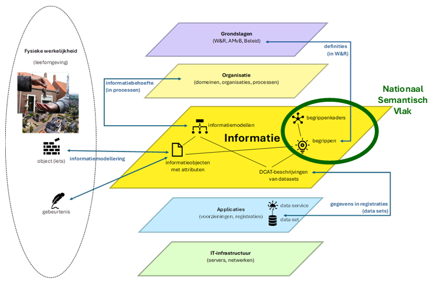
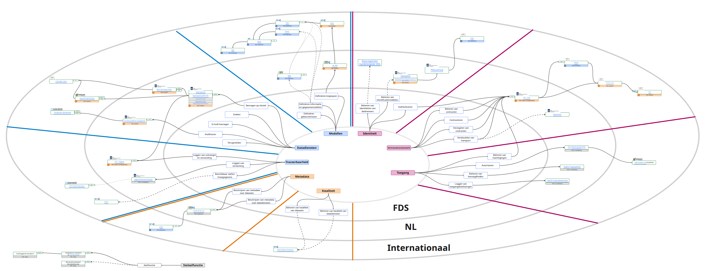
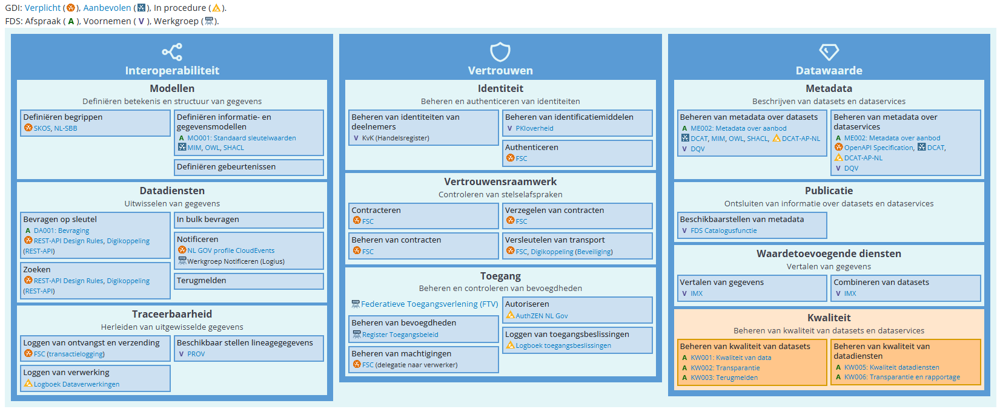
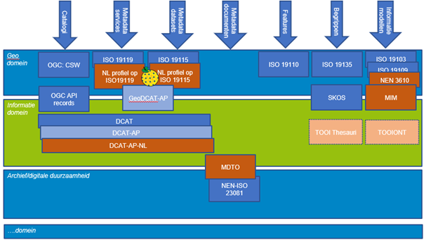

# Stelsel

## Afspraken en architecturen

Er zijn diverse afsprakenstelsels en architecturen in Nederland waar Metadata standaarden een belangrijke rol in spelen. Een aantal worden hieronder uitgelicht.

<aside class="note">
De afbeeldingen hieronder kunnen groter gemaakt worden door erop te klikken. De bronverwijzing zit in de titel van de afbeelding eronder.
</aside>

### NORA Nationaal Semantisch Vlak

De Nederlandse Overheid Referentie Architectuur (NORA) helpt overheidsorganisaties met het vorm geven en inrichten van hun dienstverlening. De kern bestaat uit de Verbindende Architectuurafspraken en een uitwerking van het Vijflaagsmodel. Daarnaast bevat de NORA veel informatie over verschillende thema's, waaronder gegevensmanagement. Binnen gegevensmanagement wordt het Nationaal Semantisch Vlak gepositioneerd als een verzameling van alle begrippen die voor de Nederlandse dienstverlening en informatiehuishouding van de overheid relevant zijn. De metadastandaarden spelen een belangrijke rol bij deze beschrijvingen.

<figure id="i1">

<figcaption><a href="https://www.noraonline.nl/wiki/Nationaal_Semantisch_Vlak" target="_blank">NORA Nationaal Semantisch Vlak</a>
</figcaption>
</figure>

### FDS

Het is de ambitie van het Federatief Datastelsel (FDS) om Nederlandse overheidsorganisaties op eenvoudige en verantwoorde wijze hun data met elkaar te laten delen ten bate van maatschappelijke vraagstukken en publieke dienstverlening.

Het Afsprakenstelsel Federatief Datastelsel bevat de gezamenlijke spelregels die nodig zijn om data overheidsbreed te vinden, delen en verantwoord te gebruiken. Het gaat om technische, semantische, juridische en organisatorische afspraken die samen een stabiel vertrouwensraamwerk vormen.

Binnen de stelselfuncties 'Metadata' en 'Modellen' vinden we de metadata standaarden die in deze handreiking verder beschreven worden.

<figure id="i2">

<figcaption><a href="https://federatief.datastelsel.nl/kennisbank/standaardenlandkaart/" target="_blank">FDS Standaarden landkaart</a>
</figcaption>
</figure>

<figure id="i3">

<figcaption><a href="https://federatief.datastelsel.nl/kennisbank/stelselfuncties/#technische-stelselfuncties" target="_blank">FDS Technische stelselfuncties</a></figcaption>
</figure>

### ADO (Architectuur Digitale Overheid) - Domeinarchitectuur Gegevensuitwisseling

Ook in Domeinarchitectuur Gegevensuitwisseling van de Architectuur Digitale Overheid vinden we de metadatastandaarden terug bij de <a href="https://www.noraonline.nl/wiki/Verdieping_Metagegevens_Domeinarchitectuur_Gegevensuitwisseling" target="_blank">verdieping metagegevens</a>. 

Er zijn een aantal kernboodschappen onderdeel van de Domeinarchitectuur Gegevensuitwisseling:

- Gegevens moeten beschikbaar zijn voor hergebruik door anderen en voldoen aan de FAIR principes: vindbaar, toegankelijk, interoperabel en herbruikbaarheid.
- Metagegevens zijn een kritische succesfactor voor gegevensuitwisseling en moeten op allerlei niveaus, aan elkaar verbonden en als Linked Data beschikbaar zijn.
- Gegevens moeten contextrijk worden vastgelegd, inclusief historie, om discussie over de feiten, de herkomst en de betekenis van gegevens zoveel mogelijk te voorkomen.
- De betekenis en structuur van gegevens moet expliciet worden gemaakt in begrippen, informatie- en gegevensmodellen, aan elkaar verbonden en traceerbaar naar de wet.

Door de metadata standaarden in samenhang te gebruiken kan invulling gegeven worden aan deze uitgangspunten.

### Stelselcatalogus - Logius

Een voorbeeld van het in samenhang gebruiken van de metadata standaarden gebeurt in de (doorontwikkeling van de) <a href="https://www.stelselcatalogus.nl/" target="_blank">stelselcatalogus</a>. 

_De Stelselcatalogus biedt u inzicht, overzicht en duiding in overheidsgegevens. Hier vindt u gegevens over gegevens (metadata). Zo krijgt u inzicht in welke registraties welke gegevens bijhouden. En welke betekenis deze gegevens hebben. Ook vindt u hoe de gegevens uit verschillende registraties zich verhouden tot elkaar. De Stelselcatalogus helpt u informatie over gegevens te vinden binnen het landschap van overheidsgegevens._

## Samenhang met gerelateerde standaarden

In bovenstaande voorbeelden komen een aantal metadata standaarden aan bod. In deze paragraaf lichten we toe hoe deze standaarden samenhangen.

### NL-SBB

De <a href="https://docs.geostandaarden.nl/nl-sbb/nl-sbb/" target="_blank">NL-SBB - Standaard voor het beschrijven van begrippen</a> geeft aan hoe begrippen in een begrippenlijst, taxonomie of thesaurus eenduidig worden beschreven.

Begrippen bestaan op het niveau van taal; ze beschrijven woorden (termen) en hun definitie. 
- Informatiemodellen (zie MIM) formaliseren deze taal zodat met voldoende exactheid informatie over de werkelijkheid kan worden vastgelegd. De objecttypes in informatiemodellen en hun definitie kunnen overeenkomen met die van begrippen, of daarvan zijn afgeleid. 

- In de beschrijving van Datasets (zie DCAT en ISO19115/19119) kan gebruik gemaakt worden van Keywords of Thema's waarbij deze beschreven kunnen worden via de NL-SBB standaard.

- Een NL-SBB begrippenkader kan op zich ook beschouwd worden als een dataset (danwel distributie) en kan dus van metadata voorzien worden met de DCAT-AP-NL standaard.

Er is ook een <a href="https://geonovum.github.io/NL-SBB/bp/" target="_blank">Best Practices document</a> voor het gebruiken van de NL-SBB standaard.

### MIM

De <a href="https://docs.geostandaarden.nl/mim/mim/" target="_blank">MIM - Metamodel Informatie Modellering</a> standaard beschrijft een metamodel waarmee informatiemodellen gemaakt kunnen worden. De kern van de standaard bestaat uit 4 beschouwingsniveaus:
- Beschouwingsniveau 1 - Model van begrippen
- Beschouwingsniveau 2 - Conceptueel informatiemodel
- Beschouwingsniveau 3 - Logisch informatie- of gegevensmodel
- Beschouwingsniveau 4 - Fysiek of technisch gegevens- of datamodel

Hierbij kan het model van begrippen dus met de NL-SBB standaard beschreven worden. Vervolgens schrijft de MIM standaard voor hoe de 'vertikale lineage' (verbondenheid) tussen de beschouwingsniveaus vastgelegd kan worden. Bij de Dataset die met DCAT of ISO metadata beschreven is kan worden vastgelegd op welk Fysiek of technisch gegevens- of datamodel de dataset gebaseerd is, waarbij er dus een relatie ligt tussen MIM en DCAT of ISO 19115/19119.

### MDTO

<a href="https://www.nationaalarchief.nl/archiveren/mdto" target="_blank">MDTO (Metagegevens voor duurzaam toegankelijke overheidsinformatie)</a> is een Nederlandse norm voor het vastleggen en uitwisselen van eenduidige metagegevens om de duurzame toegankelijkheid van overheidsinformatie mogelijk te maken. Anders geformuleerd: MDTO is primair een instrument voor overheidsorganisaties om de verplichtingen uit de Archiefwet en de Wet open overheid (Woo) te kunnen nakomen. Daarbij gaat het niet alleen om de fase van overbrenging naar een archiefinstelling, maar ook om de eisen die gesteld worden aan de eigen informatiehuishouding. 

DCAT-AP-NL, MDTO en NL profiel op ISO 19115 kennen inhoudelijk een aantal overeenkomsten en verschillen. 

1.	MDTO gaat uit van informatie objecten en DCAT en ISO 19115 van datasets.
2.	MDTO gaat uit van bestanden en DCAT en ISO 19115 van distributies
3.	MDTO en ISO 19115 zijn XML gebaseerd, DCAT op RDF

<figure id="i2_3">

<figcaption>de relatie tussen MDTO, DCAT en ISO metadatastandaarden</figcaption>
</figure>

Meer informatie hierover is te vinden in de volgende <a href="https://www.geonovum.nl/geo-standaarden/metadataprofiel-dcat-ap-nl/relaties-verschillende-metadata-standaarden" target="_blank">notitie</a>