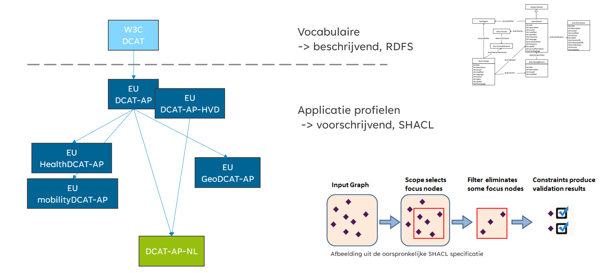
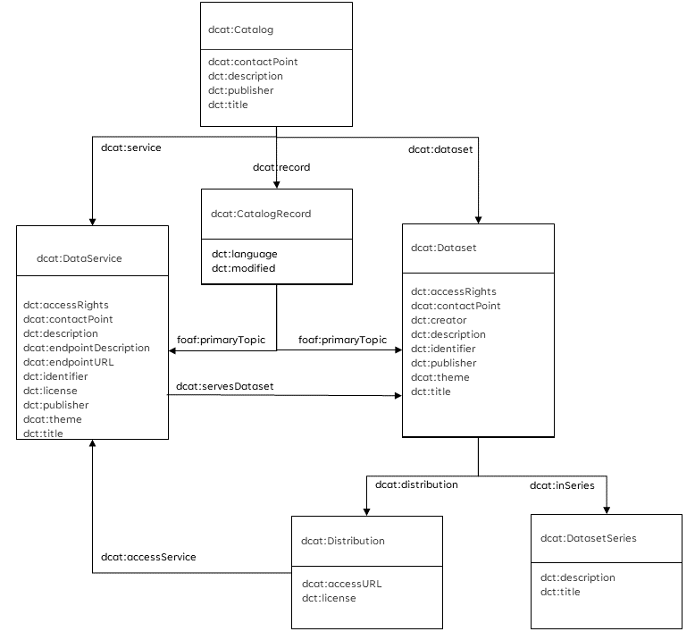

# Metadata standaarden

Er zijn diverse metadata standaarden voor datasets, distributies en services. Degene die een belangrijke rol spelen in de Nederlandse context lichten we hier verder toe.

<figure id="i4">
    
    <figcaption>DCAT Landschap</figcaption>
</figure>

## DCAT

<a href="https://www.w3.org/TR/vocab-dcat-3/" target="_blank">DCAT</a> is een RDF vocabulaire van het W3C om data te beschrijven. [[vocab-dcat-3]] maakt gebruik van verschillende andere RDF vocabulaires, zoals [[DCTERMS]], [[FOAF]] en [[PROV-O]]. Kenmerkend voor deze vocabulaires is dat ze beschrijvend van aard zijn, ze beschrijven welke eigenschappen je vast zou kunnen leggen, zonder hier een verplichtend kararkter aan te verbinden.

Onderstaande plaat laat op hoofdlijnen zien hoe de structuur van DCAT eruit ziet. (let op, er zijn meer klassen en eigenschappen dan er in deze plaat opgenomen zijn).

- Een __Dataset__ is een zinvolle verzameling van samenhangende gegevens, die beheerd of gepubliceerd wordt door één organisatie.
- Een __Distributie__ beschrijft hoe een dataset te verkrijgen is. Een Distributie levert rechtstreeks een dataset in een specifiek formaat op.
- Een __DataService__ is een computer service waar gegevens opgevraagd worden aan de hand van specificaties in een aanvraag. De gegevens die voldoen aan de meegegeven specificatie worden als antwoord teruggestuurd. Webservices zoals REST/JSON, WMS of XML interfaces zijn voorbeelden van dcat:DataService. Merk op dat als de specificatie slechts een deel van de gegevens beschrijft, alleen desbetreffende subset wordt opgestuurd.

Dataservice is een klasse die in versie 3 van DCAT is toegevoegd om een specifieker onderscheid te kunnen maken tussen 'vast vormgegeven' downloads (Distributies) en 'flexibele' DataServices, waar je afhankelijk van de vraag dus een ander antwoord kunt krijgen. In oudere metadata beschrijvingen zijn Services soms nog als Distributies opgenomen. Merk verder op dat een DataService in principe een resultaat kan teruggeven wat bestaat uit gegevens uit meerdere Datasets. 

Voor het vastleggen van kwalitatief goede metadata willen we kunnen afspreken dat bepaalde eigenschappen minimaal ingevuld moeten zijn of een waarde uit een voorgeschreven lijst moeten bevatten. Dit is waar de 'applicatie profielen' hun intrede doen.

## DCAT-AP en DCAT-AP-HVD

Het kenmerk van een applicatie profiel is dat er verplichtende eigenschappen en/of waardenlijsten beschreven kunnen worden. Dit wordt gedaan door het profiel in [[SHACL]] te beschrijven.
Het Europese [[DCAT-AP]] profiel beschrijft waar metadata voor het Europese Dataportaal aan moet voldoen. Het bevat een basisset van algemene eigenschappen om metadata over domeinen heen uit te kunnen wisselen. Voor datasets die onder de HVD regeling vallen geldt dat deze conform het [[DCAT-AP-HVD]] profiel beschreven moeten worden.

## Domein specifieke applicatie profielen

Binnen domeinen kan er behoefte zijn om metadata meer gedetailleerd te beschrijven met eigenschappen die belangrijk zijn in het specifieke domein. Hiervoor bestaan verschillende domein specifieke applicatie profielen die voldoen aan het algemene DCAT-AP profiel, maar daar aanvullende eigenschappen of restricties op definieren. Voorbeelden hiervan zijn HealtDCAT-AP in het gezondheidsdomein en MobilityDCAT-AP in het mobiliteitsdomein.

## DCAT-AP-NL

[[DCAT-AP-NL]] is het generieke Nederlandse DCAT applicatie profiel. Dit sluit aan op het Europese DCAT-AP profiel en is binnen Nederland bedoelt voor uitwisseling tussen domeinen.

Daar waar er meer specifieke Metadata standaarden voor Datasets zijn zoals in het geodomein (ISO 19115/19119), het mobiliteitsdomein (MobilityDCAT-AP) of het gezondheidsdomein (HealthDCAT-AP) kunnen de specifieke standaarden gebruikt worden. Bij de catalogi voor de specifieke domeinen wordt vervolgens geregeld dat metadata die in een domeinspecifiek formaat is aangeleverd geconverteerd kan worden naar het meer algemene DCAT-AP-NL. 

## ISO 19xxx

## Metadata standaarden

Er zijn verschillende niveaus waarvoor metadata aangemaakt kunnen worden;

Metadata van data, beschrijft de dataset of dataset serie
Metadata van services, beschrijft de dataservice (WMS, WFS) waarmee (een) ruimtelijke dataset(s) wordt ontsloten.

Specifiek voor metadata zijn in Nederland “Het Nederlands metadata profiel op ISO 19115“ en het “Het Nederlands metadata profiel op ISO 19119” gemaakt, zij maken onderdeel uit van het framework van standaarden. De Nederlandse metadata profielen zijn in een continu proces met de Europese en internationale context tot stand gekomen. Bij het volgen van het Nederlandse profiel, voldoet men ook aan INSPIRE en de verplichte elementen van ISO.

Internationaal gelden voor ruimtelijke data de ISO metadata normen, ISO 19115 voor data en ISO 19119 voor services en waar relevant de OGC specificaties. INSPIRE heeft een Implementing Rule en een technische metadata richtlijn gemaakt. Deze Implementing Rule voor metadata bevat een Europese set voor discovery, evaluation en use. In de praktijk houdt INSPIRE zich voornamelijk bezig met metadata voor discovery.

Een steeds breder toegepaste standaard is de DCAT standaard. Deze is niet specifiek voor ruimtelijke data. Het is een standaard om verschillende datacatalogi met elkaar uit te kunnen wisselen. Op deze W3C standaard is ook een europees applicatie profiel ontwikkeld en daarnaast het [geoDCAT profiel](https://joinup.ec.europa.eu/release/geodcat-ap/10). dit is een extentie op DCAT waarmee het beter mogelijk wordt ruimtelijke data te beschrijven. [DCAT2](https://www.w3.org/TR/vocab-dcat-2/) heeft zelf al meer mogelijkheden om ruimtelijke data te beschrijven. 

De Nederlandse metadatastandaarden hebben een internationale, Europese en sectorale context. De ISO-kernset is de kleinste eenheid, een selectie uit ISO 19115:2003, die de verplichte internationale metadata elementen aangeeft. Binnen Nederland is de Europese kernset uitgebreid met de specifieke behoeften van de gebruikers in Nederland en is de aansluiting op www.overheid.nl verzorgd.

De Nederlandse kernset bevat de Europese kernset (INSPIRE) plus een selectie van metadata-elementen uit ISO 19115 die van belang zijn voor het Nederlandse werkveld.

De kernset bevat de verplichte of door conditie verplichte elementen. Daarnaast zijn er optionele elementen.

Optionele elementen  zijn een selectie uit ISO 19115, die ook van belang kunnen zijn om data goed te beschrijven. De optionele elementen zijn echter niet voor elke dataset relevant. Deze selectie is gemaakt om de interoperabiliteit te bevorderen. Dezelfde metadata elementen worden gebruikt om aanvullende informatie op de kernset uitwisselbaar te maken.

Sectoren in Nederland kunnen een eigen uitbreiding op het Nederlandse profiel ontwikkelen. Voorwaarde is dat de Nederlandse kernset metadata onderdeel is van het sectorale metadata profiel. Deze sectorale uitbreidingen dienen onderdeel te zijn van ISO 19115.

## INSPIRE

Voor de INSPIRE thema's is het wettelijk verplicht om metadata  beschikbaar te stellen die voldoet aan de invoeringsregels van INSPIRE. “Het Nederlandse metadata profiel op ISO 19115 “en “Het Nederlandse metadata profiel op ISO 19119” bevatten de eisen vanuit INSPIRE.
In de wiki [Aan de slag met INSPIRE](https://wiki.geonovum.nl/index.php?title=Aan_de_slag_met_INSPIRE) vind je meer informatie voor de implementatie van INSPIRE en ook specifiek [instructies voor INSPIRE dataset metadata](https://wiki.geonovum.nl/index.php?title=Invulinstructie) en  [Voorbeeld XML voor INSPIRE dataset metadata](https://wiki.geonovum.nl/index.php?title=Voorbeeld_XML_voor_INSPIRE_dataset_metadata).
Daarnaast zijn er ook [instructies voor INSPIRE service metadata](https://wiki.geonovum.nl/index.php?title=Invulinstructie_voor_services) en [Voorbeeld XML voor INSPIRE service metadata](https://wiki.geonovum.nl/index.php?title=Voorbeeld_XML_voor_INSPIRE_service_metadata)

<!-- ## Opdracht standaarden

1. Ga naar de [INSPIRE richtlijn voor metadata](http://eur-lex.europa.eu/LexUriServ/LexUriServ.do?uri=OJ:L:2008:326:0012:0030:NL:PDF).
Welke metadata elementen worden voor een dataset voorgeschreven, welke voor services?

1. Ga naar [De technische guideline die bij de invoeringsregels hoort](http://inspire.jrc.ec.europa.eu/reports/ImplementingRules/metadata/MD_IR_and_ISO_20090218.pdf).
Welke metadata elementen worden voor een dataset voorgeschreven, welke voor services?

1. Ga naar [Het Nederlands profiel op ISO 19115](http://www.geonovum.nl/sites/default/files/standaarden/NLmetadataprofielISO19115v12maart.pdf) Welke metadata elementen komen niet in INSPIRE voor?

1. Ga naar [De Nederlandse metadata standaard voor services](http://www.geonovum.nl/geostandaarden/metadata) 
Vergelijk de metadata elementen.
-->

